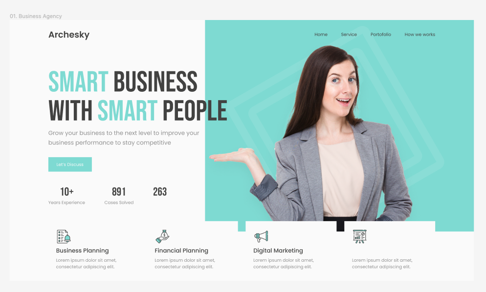

<h1 align="center" style="color: #0366d6;">
  HTML & CSS HeaderSaga
</h1>

¡Bienvenid@ developer! Me entusiama presentarte el primer volumen de mi querida HeaderSaga con la que espero que disfrutes y aprendas del apasionante mundo del desarrollo web.

<!-- <picture>

  <source srcset="image.avif">
  <source srcset="image.webp">
  
</picture> -->

### Mi objetivo ✅

Deseo mostrarte alguna de mis skills que he ido desarrollando con el tiempo con mucho cariño y entusiasmo.En este caso me centraré en crear headers profesionales de diferentes empresas utilizando HTML y CSS nativo.Todos los

### Dimensiones Óptimas - 1290x1080 💻

Todos y cada uno de los encabezados han sido diseñados para visualizarse en una resolución de 1290px ancho y 1080px de alto por lo que si deseas apreciar cada detalle te aconsejo encarecidamente que utilices dicha resolución.

### Pasos a seguir 🛠️

1. Clona o descarga este repositorio.
2. Navega y analiza todas las carpetas y archivos.
3. Abre el archivo "index.html" en tu navegador favorito.
4. Disfruta y analiza el contenido.

---

<h2 align="center">
  Header Business Agency 💼
</h2>

  
  

### Descripción 📝

Este encabezado está diseñado para una agencia de negocios, destacando un H1 llamativo y un diseño limpio y profesional.

## Licencia 📜

Este proyecto está bajo la licencia [MIT] - Consulta el archivo [LICENSE](LICENSE) para más detalles.
